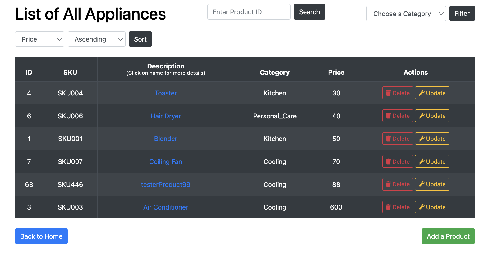
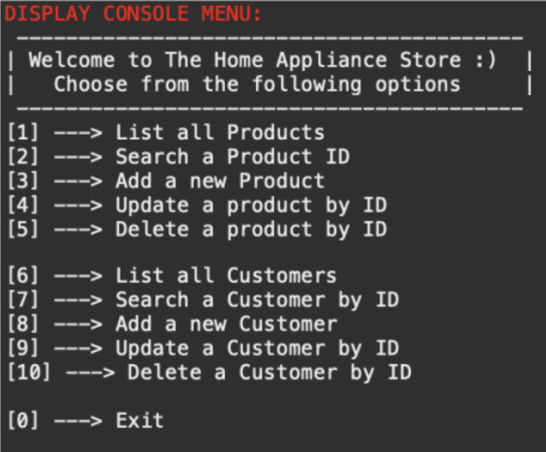
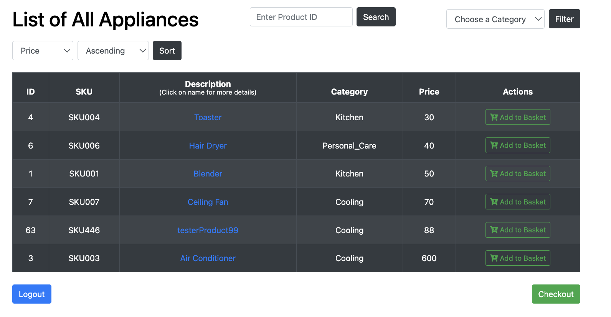

# The Home Appliance Store
The Home Appliance Store is a Java-based application that manages home appliance products and customer data via an SQLite database. It features a console menu for admin and user interactions, along with a web frontend for browsing, managing products, and handling customer orders. Admins can manage appliance details, while users can add products to their baskets and complete purchases.

## Disclaimer
All product and customer data are randomly generated. Names, phone numbers, addresses, descriptions, categories, and prices are fictitious and used solely for educational purposes.


## Tech Stack
- **Backend:** Java, SQLite
- **Frontend:** HTML, CSS, Bootstrap
- **Security:** BCrypt

## Installation
1. Clone the repository:
   ```sh
   git clone https://github.com/your-repo/home-appliance-store.git
   ```
2. Open the project in your preferred Java IDE.
3. Ensure `store.sqlite` is placed in the project directory.
4. Run the `Main.java` file to start the application.


## Backend

### - Menu System - Console
A console-based menu allows users to interact with the database using a loop-controlled `switch-case` structure.

### - Database Connection
Utilizes `DriverManager.getConnection(url)` to establish a connection with `store.sqlite`.

### - Retrieve Appliances
Fetches all appliances into an `ArrayList` using SQL queries.

### - Search by ID
Executes parameterized queries to find specific appliances.

### - CRUD Operations
Supports inserting, modifying, and removing products/customers with prepared statements.


## Frontend

### Product Display
Dynamically generates tables with appliance data using HTML and Bootstrap.

### Admin Controls
Admins can add, modify, and delete products, while regular users can only add them to their basket.


## Screenshots
<div style="display: flex; justify-content: center; gap: 20px;">
  
  
  
</div>

## Advanced Features

- Basket System
Users can add products to a shopping basket and proceed to checkout.

- Sorting & Filtering
Appliances can be sorted and filtered by ID or category.

- Authentication
A login and registration system differentiates between admin and standard users.

- Testing & Security
JUnit tests validate core functionality. Passwords are securely hashed using `BCrypt`.

## Future Prospects
- User Recommendations: Implement machine learning for personalized product suggestions.
- Mobile Version: Create a mobile-friendly interface for on-the-go access.
- Inventory Management: Add features like stock tracking and order management.
- API Development: Build an API for third-party integrations.
- Security Enhancements: Introduce multi-factor authentication for users and admins.


